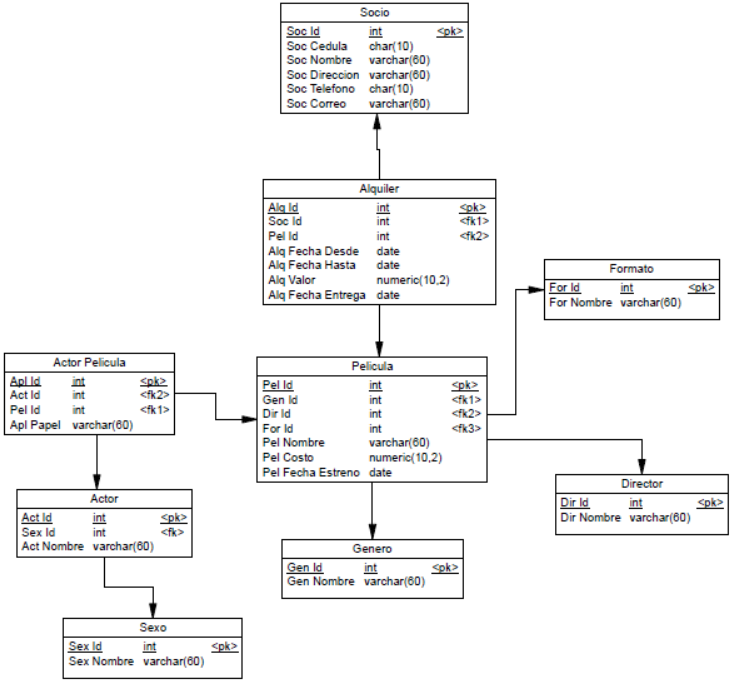
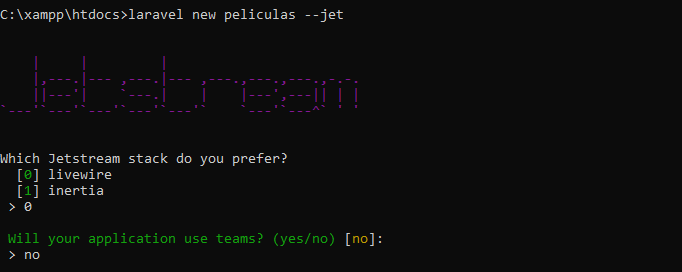
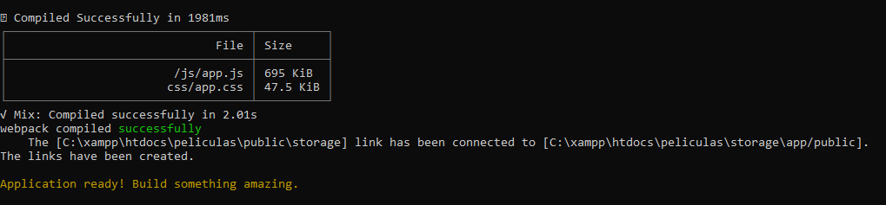
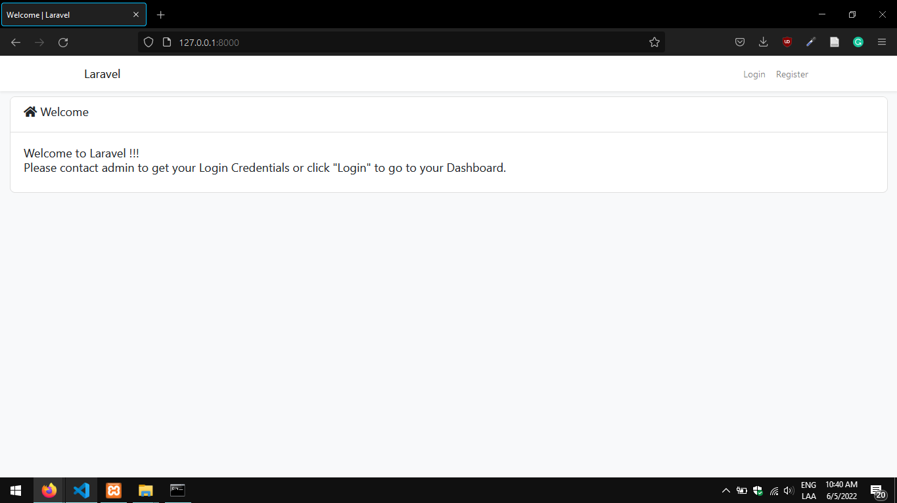
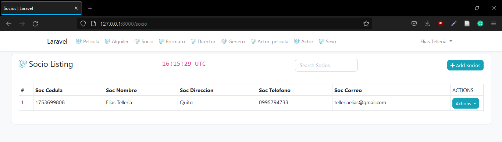

## Acerca del Proyecto

Esta aplicación fue generada con ayuda de [Laravel Jetstream](https://jetstream.laravel.com/2.x/introduction.html), [Composer](https://getcomposer.org) y [LiveWire CRUD Generator](https://github.com/flightsadmin/livewire-crud) esta basada en una tienda de alquiler de peliculas.

### Instalaciones Necesarias
- [Node JS](https://nodejs.org/es/)
- [Composer](https://getcomposer.org)

## Diagrama de la BDD
A continuación se muestra el diagrama de la base de datos utilizada en el proyecto:
<p align="center"><a href="https://laravel.com" target="_blank"></a></p>


## 1. Clonar el proyecto

Para descargar el proyecto es necesario clonar el repositorio:
``````
git clone https://github.com/tellxmaster/peliculas.git
``````

## 2. Reconstruir los paquetes de node
Para esto debes abrir el proyecto con [VS Code](https://code.visualstudio.com/) o cualquier otro editor de codigo, debes abrir una terminal y ejecutar el comando: 
`````` 
npm install
`````` 

Tambien es necesario reconstruir las dependencias de composer con:

`````` 
composer install
`````` 

y finalmente configurar generar el archivo .env

## 3. Reconstruir la base de datos
La base de datos esta diseñada en MySQL con la ayuda de [XAMPP](https://www.apachefriends.org/es/index.html) para reconstruir la BDD es necesario importar el script contenido en la ruta
``/database/db_peliculas.sql`` desde [http://localhost/phpmyadmin/](http://localhost/phpmyadmin/) para lo que debemos crear una base de datos con el nombre ``peliculas``, seguido de esto le damos a importar y una vez terminada la importación la base de datos estaria lista para utilizarse.

## 4. Levantar el servidor del proyecto 

Para esto es necesario ir a Visual Studio Code abrir una terminal y ejecutar el comando:
`````` 
php artisan serve
``````


## ¿Comó  fue construido el proyecto?
Empezamos instalando laravel con ayuda de composer para esto ejecutamos el comando:
`````` 
composer global require laravel/installer
`````` 
Una vez instalado laravel/installer debemos crear el proyecto con la ayuda del comando:
`````` 
laravel new peliculas --jet
`````` 
Esto ejecutara el laravel/instaler que nos ayudara a crear el proyecto, debemos escoger la opcion de ``livewire`` escribiendo ``0``,  seguido de esto debemos escoger si la aplicación va a usar teams y ponemos ``no``:

<p align="center"><a href="https://laravel.com" target="_blank"></a></p>

Despues debemos esperar a que el proyecto se termine de crear nos pedira ejecutar el comando:
````
npm install && npm run dev
````
Para esto debemos abrir el proyecto en Visual Studio Code y iniciar una terminal, pasados unos segundos el comando se ejecutara automaticamente.

Una vez haya finalizado la instalación se mostrara un mensaje:

<p align="center"></p>

Podemos probar el funcionamiento del proyecto ejecutando:

`````` 
php artisan serve
``````
y dirigiendonos a la siguiente [direccion](127.0.0.1:8000/), si todos los pasos previos fueron realizados podremos ver la siguiente pantalla:

<p align="center"></p>

Lo siguiente que debemos hacer es instalar el 
[LiveWire CRUD Generator](https://github.com/flightsadmin/livewire-crud) via composer, para lo que dentro de la carpeta de nuestro proyecto debemos ejecutar el comando:
````
composer require flightsadmin/livewire-crud
````
Una vez ejecutado este comando ejecutar el comando: 
````
php artisan crud:install
````
Una vez ejecutado el comando podremos crear nuestros CRUD's con la ayuda de el comando:
````
php artisan crud:generate {nombre_de_tabla}
````
Esto lo hacemos con todas las tablas mostradas en el [Diagrama](#diagrama-de-la-bdd) tomando en cuenta las relaciones debemos generar los CRUD de afuera hacia adentro.

## Manejo de los Errores de Pluralización
Uno de los errores más comunes que puedes presentar con el uso de este generador CRUD es que este pluraliza los nombres de las bases de datos, es decir si nosotros tenemos una tabla ``socio`` el generador le asignara el nombre de ``socios`` esto puede ocasionar varios errores como:


````
View [livewire.socio.index] not found.
````
Esto se puede arreglar de la siguiente manera:
##
- Nos dirijimos a la ruta ``app\Models\{Nombre_del_Modelo}.php`` y modificamos el nombre de la tabla ``socios`` por ``socio`` como se muestra a continuación:

````
protected $table = 'socio';
````

- Lo siguiente que debemos hacer dirigirnos a ``\routes\web.php`` y modificamos la ruta  ``livewire.socio.index`` por ``livewire.socios.index`` debido a que esta ruta esta apuntando al directorio ``/resources/views/livewire/socios`` por el problema de la pluralización.

Una vez realizados estos pasos deberiamos ser capaces de ver el listado de socios.

<p align="center"></p>


<a rel="license" href="http://creativecommons.org/licenses/by-nc/4.0/"></a><br />This work is licensed under a <a rel="license" href="http://creativecommons.org/licenses/by-nc/4.0/">Creative Commons Attribution-NonCommercial 4.0 International License</a>.